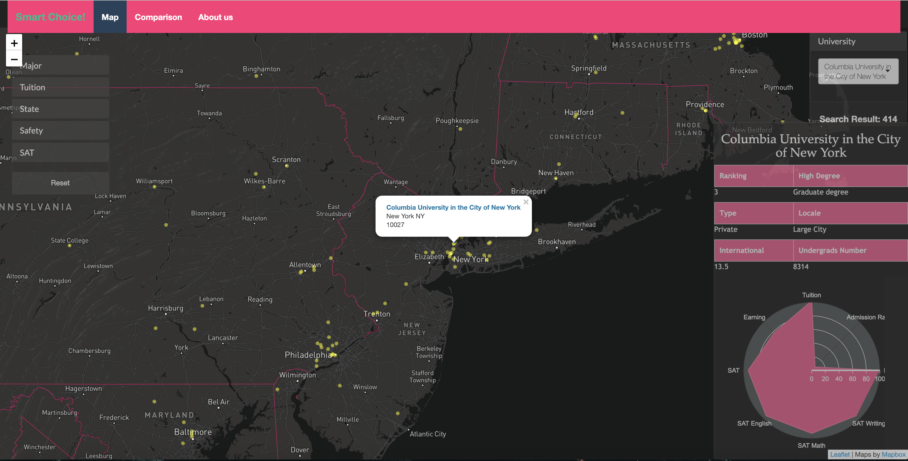
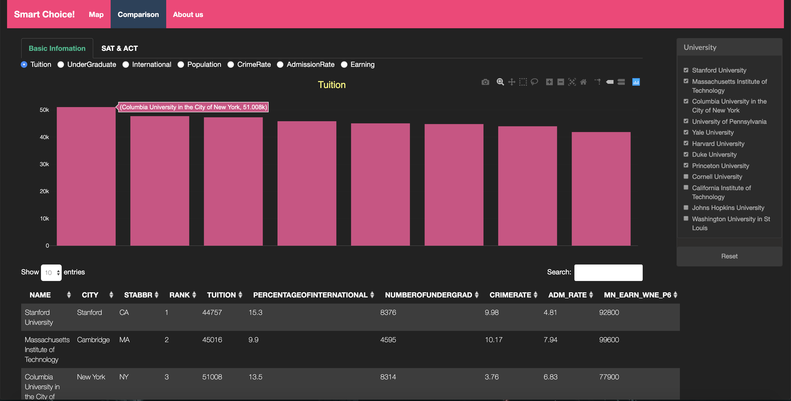

# Project 2: Shiny App Development Version 2.0

### [Project Description](doc/project2_desc.md)


## Project Title: Smart College Choice
Term: Spring 2019

+ Team #2
+ **Projec title**: Smart College Choice
	+ Yiwei Li (Presenter)
	+ Tianchen Wang
	+ Fei Zheng 
	+ HyunBin Yoo


Shiny App link: [https://feizheng.shinyapps.io/Shiny_App_Education/](https://feizheng.shinyapps.io/Shiny_App_Education/)

+ **Project summary**: Our project takes all available data on colleges and universities in New York State and attempts to create a user-friendly shiny app that allows users to **explore** and **compare** schools based on user-specific filtering criteria. The purpose of our design is to provide users with a bird's eye view of New York colleges and universities; allow them to filter, search, and group schools by their preferred criteria; and further compare those schools on a more micro level. 
+ **Distinguishing features**: 
  + The first feature of our app is the map search function. Before we select any filter conditions, we can see all the schools on the map, which gives an overall view of the colleges. After selecting some filtering conditions, the results will show on the map **dynamically**.
  + The second feature of our app is that almost all the filtering buttons will react to the filtering conditions you choose, which makes it more convenient to choose.
  + The third feature of our app is that you can locate a specific college very quickly and see basic information.
  + The fourth feature of our app is that after filtering you can compare more detailed information by going directly to **Comparison** tab and choose the colleges you want them showed on plots.





 

**Contribution statement**

+ Tianchen Wang cleans the data, finishes the *Safety* button, makes all the *popup information* and *basic information(including radar chart)* on the map tab, adjusts the appearance and writes tab *about us*.
+ Fei Zheng makes *Major*, *State* button and *University* button on the map tab, finishes the *Comparison* tab and adjusts the appearance.
+ HyunBin Yoo makes *SAT* button and adjusts the appearance.
+ Yiwei Li makes *Tuition* button, chooses the main themes and prepares the presentation.


Following [suggestions](http://nicercode.github.io/blog/2013-04-05-projects/) by [RICH FITZJOHN](http://nicercode.github.io/about/#Team) (@richfitz). This folder is orgarnized as follows.

```
proj/
├── app/
├── lib/
├── data/
├── doc/
├── figs/
└── output/
```

Please see each subfolder for a README file.

